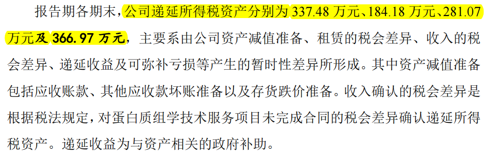
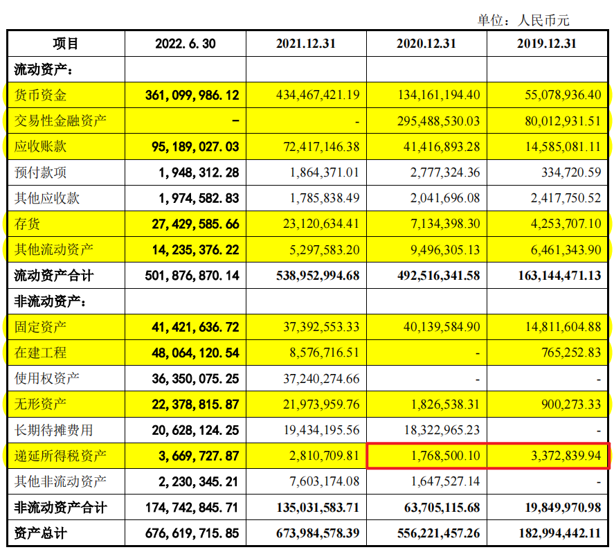

# 财务勾稽关系校验Verification of financial articulation

## 1、准备工作。下载rules文件夹中的财务勾稽关系规则 

## 2、运行main.py函数。主要分为以下几个步骤：
- `extract_rule.py`规则解析：将我们根据专家知识，人工制定的财务勾稽规则解析为字典对象。
- `pdf_tables_extract.py`表格抽取：将pdf文件中的表格抽取为excel文件存储下来。
- `data2json.py`excel表格转json格式：将存储下来的表格转换为方便处理和遍历的json格式。
- `cross_judge.py`跨表勾稽关系校验：检验跨表同名字段数据一致性；根据规则计算数据一致性。
- `inner_judge.py`表内勾稽关系校验：对于不同招股书的特定表格，进行表内数据加和校验。
- `text_judge.py`文表勾稽关系校验：校验文字部分对应的表格字段数据一致性。
- `util.py`通用函数：包含数据一致性校验，出错内容重定位等

## 3、输出文件。程序运行完成后将生成以下文件：
- `tables`文件夹，包含所有从招股书pdf文档中抽取出的表格
- `table_content.json`文件，为表格数据合并为json格式后的存储形式。
- `Articulation_out`文件夹，包含程序输出
    - `main_cross.json`：跨表勾稽的输出文件
    - `main_inner.json`：表内勾稽的输出文件
    - `main_text.json`：文表勾稽的输出文件
    - `main_highlight.pdf`：pdf文档对校验内容经过自动高亮显示后的效果
    - 其他：各自校验文件单独运行的输出结果

## 4、示例
**文字段（位于招股书文档第301页）**

**表格字段（位于招股书文档第213页）**

可以看到2019和2020年的“递延所得税资产”数据存在差异
